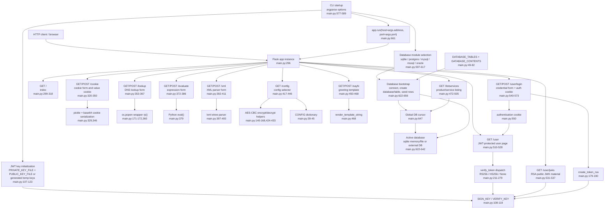

# Breakable Flask Architecture Diagram

## Evidence Notes

- Runtime entry is the `if __name__ == "__main__"` block, which parses CLI options, selects and initializes a database connector, bootstraps tables and seed data, then starts Flask with `app.run`.
- The only in-repository application process is the Flask web server. Optional external database containers are documented separately for PostgreSQL, MySQL, MSSQL and Oracle.
- Route handlers, helper functions, configuration constants, key initialization and persistence setup all live in `main.py`.
