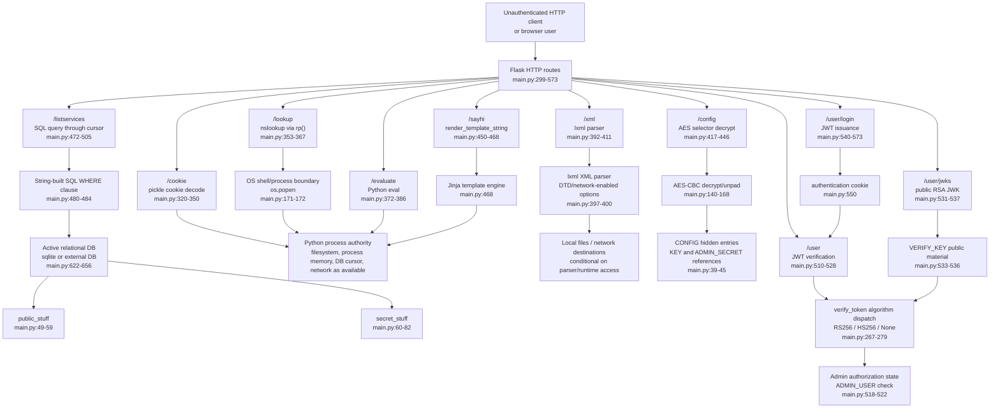

# Architecture-Level Threat Model Diagram

## Diagram Scope

This diagram shows trust-boundary crossings and sensitive consumers evidenced by the implementation. It is a threat-model diagram, not a validated vulnerability report and not a remediation plan.
